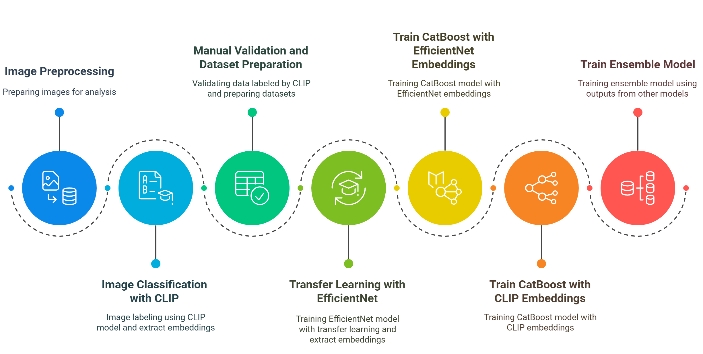

---
# SRH image classification using ensemble of CLIP, EfficientNet and CatBoost models

This repository contains a ensemble classification of Siberian radioheliograph images that combines EfficientNet (CNN), CLIP (multimodal), and CatBoost (tabular) models.

## [Installation](#-installation) — [Dataset](#-dataset) — [Usage](#-usage) — [Paper](#paper) — [Citation](#citation) — [Contact](#-contact)

## 🧠 Overview

The main components are:

- **`EffnetClassifier`**: Fine-tunes an EfficientNet model for image classification.
- **`ClipClassifier`**: Uses CLIP for zero-shot image classification.
- **`CatBoostTuner`**: Trains a gradient boosting model on extracted embeddings.
- **`EnsembleClassifier`**: Combines predictions from all three models into one final prediction.


Sure! Here's an updated version of your **README** section that includes using a **virtual environment (`venv`)** for better practice and isolation:

---

## 🔧 Installation

```bash
# Clone the repository
git clone https://git.iszf.irk.ru/diegon/srh.git
cd srh

# Create and activate a virtual environment
python -m venv venv         # Create virtual environment
source venv/bin/activate    # On Windows use: venv\Scripts\activate

# Install dependencies
pip install -r requirements.txt
```


## 📥 Dataset

# Create directories
```bash
mkdir -p data
```

# Download the dataset
```bash
wget -O data/3000.zip https://forecasting.iszf.irk.ru/datasets/3000.zip
```

# Extract the dataset
```bash
unzip data/3000.zip -d data/3Ghz
```

# Optional: Remove the zip file
```bash
rm data/3000.zip
```

## 📄 Usage

You can find usage examples in:

```bash
example.ipynb
```

It includes:
- Model evaluation
- Confusion matrix and metrics

## Paper

Journal Version (Acta Astronautica): https://doi.org/10.1016/j.actaastro.2025.04.027

<!-- Open access (arXiv): https://arxiv.org/abs/id -->


## Citation

To cite this project, including the scientific basis, models and prepared dataset, please use:

```
@ARTICLE{EgorovSRH,
    title = {Forecasting F10.7 and F30 indices using the variational mode decomposition algorithm and the deep-learning Time-series Dense Encoder Model},
    journal = {Acta Astronautica},
    volume = {234},
    pages = {455-461},
    year = {2025},
    issn = {0094-5765},
    doi = {https://doi.org/10.1016/j.actaastro.2025.04.027},
    url = {https://www.sciencedirect.com/science/article/pii/S0094576525002279},
    author = {Yaroslav Egorov},
    keywords = {Space weather,  index,  index, Deep learning, Time series forecast},
    abstract = {Accurate forecasting of upper atmospheric conditions can improve the efficiency of satellite operations and reduce the risks associated with the re-entry of large debris objects. Spacecrafts are affected by atmospheric drag which is strongly correlated with solar activity. One of the most important indices of solar activity is the F10.7 index. Recent studies have shown that F30 index demonstrates a more accurate proxy for solar extreme ultraviolet emission. This study presents a deep learning model for forecasting both indices. This model is a combination of the variational mode decomposition algorithm and the Time-series Dense Encoder neural network. The model is trained to forecast individual components of decomposed data given future and past covariates to improve understanding of trend and seasonality. Comparison with other models demonstrates an improvement in forecasting accuracy up to twofold for F10.7 index. The daily forecasting service was implemented online with predicting horizons of 7 and 27 days.}
}

```

## 🤝 Contact

Yaroslav Egorov (egorov@iszf.irk.ru)
