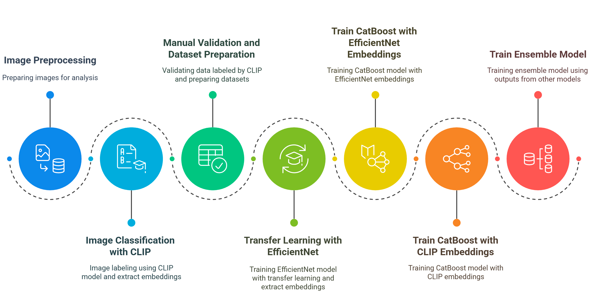

---
# SRH image classification using ensemble of CLIP, EfficientNet and CatBoost models

This repository contains a ensemble classification of Siberian radioheliograph images that combines EfficientNet (CNN), CLIP (multimodal), and CatBoost (tabular) models.

## [Installation](#installation) — [Dataset](#dataset) — [Usage](#usage) — [Paper](#paper) — [Citation](#citation) — [Contact](#contact)

## Abstract

The Siberian Radioheliograph (SRH) is a ground-based radio interferometer in Irkutsk, Russia, designed for high-resolution solar observations in the microwave range. It can observe dynamic solar events with spatial resolutions of 7-30 arcseconds and temporal resolution up to 0.1 seconds.

Generating solar radio images from the Siberian Radioheliograph (SRH) is a multi-step calibration process that corrects instrumental and atmospheric distortions, using redundancy-based calibration with both adjacent and non-adjacent antenna pairs to address phase and amplitude errors in visibility data. The CLEAN algorithm is then applied to deconvolve the point spread function, reduce sidelobes, and enhance the visibility of solar features, resulting in higher quality and more reliable images.

While the calibration process generally improves image quality, it can sometimes result in noisy or spatially shifted images that are not suitable for scientific use. We developed a deep learning approach for automatic image quality classification. The training dataset was prepared using a zero-shot CLIP model and further validated manually. We evaluated four different models: a fine-tuned EfficientNet, two CatBoost variants using embeddings from CLIP and EfficientNet, and an Ensemble model that combined predictions from all three individual models. The Ensemble model achieved the best performance.

The SRH daily image classification service has been created and is available online at https://forecasting.iszf.irk.ru/srh along with an API offering IDL and Python examples. Integration of Ensemble model into SRH image generating and calibration workflow can improve image reliability and reduces low-quality entries in SRH data catalog, enhancing solar research outcomes.

---

## Overview

The main components are:

- **`EffnetClassifier`**: Fine-tunes an EfficientNet model for image classification.
- **`ClipClassifier`**: Uses CLIP for zero-shot image classification.
- **`CatBoostTuner`**: Trains a gradient boosting model on extracted embeddings.
- **`EnsembleClassifier`**: Combines predictions from all three models into one final prediction.

---

## Installation

```bash
# Clone the repository
git clone https://git.iszf.irk.ru/diegon/srh.git
cd srh

# Create and activate a virtual environment
python -m venv venv         # Create virtual environment
source venv/bin/activate    # On Windows use: venv\Scripts\activate

# Install dependencies
pip install -r requirements.txt
```


## Dataset

# Create directories
```bash
mkdir -p data
```

# Download the dataset
```bash
wget -O data/3000.zip https://forecasting.iszf.irk.ru/datasets/3000.zip
```

# Extract the dataset
```bash
unzip data/3000.zip -d data/3Ghz
```

# Optional: Remove the zip file
```bash
rm data/3000.zip
```

## Usage

You can find usage examples in:

```bash
example.ipynb
```

It includes:
- Model evaluation
- Confusion matrix and metrics

## Paper

Journal Version (Advances in Space Research): https://doi.org/10.1016/j.asr.2025.10.030

Open access (arXiv): https://arxiv.org/abs/2507.04211


## Citation

To cite this project, including the scientific basis, models and prepared dataset, please use:

```
@article{EGOROV2025,
	title = {Siberian Radioheliograph image classification using ensemble of CLIP, EfficientNet and CatBoost models},
	journal = {Advances in Space Research},
	year = {2025},
	issn = {0273-1177},
	doi = {https://doi.org/10.1016/j.asr.2025.10.030},
	url = {https://www.sciencedirect.com/science/article/pii/S0273117725011615},
	author = {Yaroslav Egorov},	
}

```

## Contact

Yaroslav Egorov (egorov@iszf.irk.ru)
